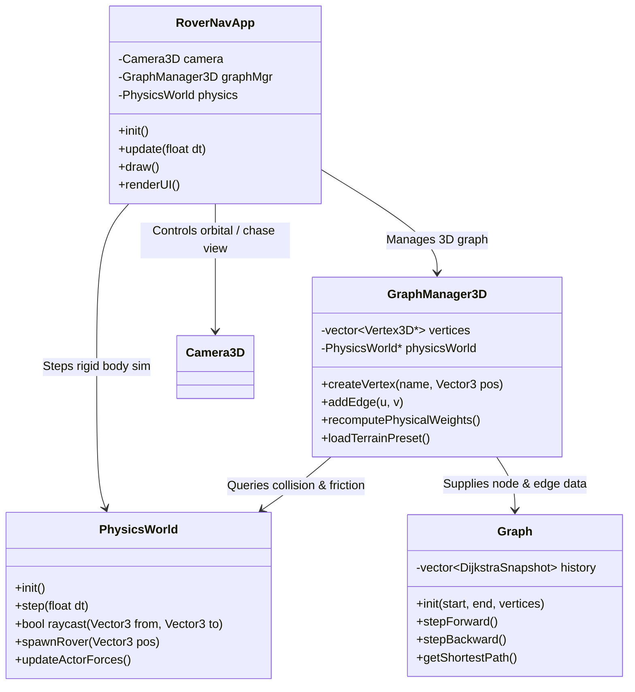

# Architectural Plan: 3D Physics-Integrated Dijkstra Simulator

## 1. Executive Summary & Objective

The objective of this plan is to evolve the current 2D visualizer (`dijkstra_sfml`) into a **3D Physics Simulator** that utilizes **Dijkstra's Algorithm**. 

Rather than treating Dijkstra as a textbook shortest-distance solver on a flat 2D plane, this simulator leverages physical properties (gravity, slope elevation, surface friction, momentum, and obstacle collision) as **cost weights** in graph traversal, followed by **real-time rigid body simulation** of actors navigating the computed path.

The simulation and graphics engine is standardized on **Raylib**, providing native 3D rendering, immediate-mode primitives, built-in orbital/chase cameras, and first-class WebAssembly/WebGL deployment support.

---

## 2. Technology Stack & Why It Was Chosen

### Standardized Stack: **Raylib + raymath + Jolt Physics + rlImGui**

```
+-------------------------------------------------------------+
|                      User Application                       |
|           (Main Loop, Simulation State, rlImGui UI)         |
+------------------------------+------------------------------+
|     3D Rendering Layer       |       Physics Engine         |
|  (Raylib 3D Primitives,      |       (Jolt Physics)         |
|   Camera3D, Shaders)         |  (Rigid bodies, Raycasting)  |
+------------------------------+------------------------------+
|                 Graph & Algorithm Core                      |
|       (Graph.cpp, DijkstraSnapshot, Physics Cost Function)   |
+-------------------------------------------------------------+
|                     Math & Platform                         |
|     (raymath.h / Vector3, Raylib macOS / WASM Platform)     |
+-------------------------------------------------------------+
```

### Justification for Each Component:

| Component | Choice | Rationale & Why It Fits |
| :--- | :--- | :--- |
| **Graphics & Windowing** | **Raylib** | • **Native 3D First-Class:** Immediate-mode 3D drawing (`DrawSphere`, `DrawCylinderEx`, `DrawGrid`, `GenMeshHeightmap`).<br>• **Built-in 3D Cameras:** One-line orbital and third-person chase cameras (`UpdateCamera`).<br>• **Cross-Platform & WASM:** First-class compilation to native macOS and WebAssembly (WebGL 2.0) for web portfolio deployment without custom shims. |
| **Math Library** | **raymath.h** (included with Raylib) | • Built-in vector, matrix, and quaternion operations (`Vector3`, `Matrix`, `Vector3Normalize`, `Vector3Distance`). No heavy external math library required. |
| **Physics Engine** | **Jolt Physics** (Alt: Bullet) | • Modern C++17/20 multithreaded architecture (used in AAA titles like *Horizon Forbidden West*).<br>• Clean C++ API, built-in heightfield collision (`HeightFieldShape`), and fast continuous collision detection (CCD). |
| **GUI & Telemetry** | **rlImGui** (Dear ImGui for Raylib) | • Header-and-source drop-in (`rlImGui.h`, `rlImGui.cpp`) integrating Dear ImGui with Raylib in under 5 lines of setup. Zero complex backend wiring. |

---

## 3. How to Build on the Existing Codebase

The current repository already has clean abstractions. Here is how each component will be adapted:

### 3.1. Reusing Algorithm & History Logic ([Graph.h](file:///Users/louie/Documents/GitHub/dijkstra_sfml/include/Graph.h), [Graph.cpp](file:///Users/louie/Documents/GitHub/dijkstra_sfml/Graph.cpp))
* **Current Strength:** The current implementation uses `DijkstraSnapshot` and pre-computes an execution timeline (`m_history`, `stepForward()`, `stepBackward()`). This is algorithmically decoupled from rendering.
* **Evolution:**
  1. Keep `DijkstraSnapshot` and step-by-step playback intact.
  2. Change edge weights from pure integer distance to **physical dynamic costs** (`float` instead of `int`).
  3. Cost formulation:
     $$\text{Cost}(u \to v) = \text{Distance}(u, v) \times \left(1.0 + \alpha \cdot \max(0, \Delta h) + \beta \cdot \text{SlopeAngle} + \gamma \cdot \text{Roughness}\right)$$
     * $\Delta h = v.y - u.y$ (traversing uphill expends more energy).
     * Slopes steeper than the physical friction angle ($\theta > \arctan(\mu)$) become impassable ($\text{Cost} = \infty$).

### 3.2. Decoupling Graph Data from 2D Renderables ([Vertex.h](file:///Users/louie/Documents/GitHub/dijkstra_sfml/include/Vertex.h), [Vertex.cpp](file:///Users/louie/Documents/GitHub/dijkstra_sfml/Vertex.cpp))
* **Current State:** [Vertex.h](file:///Users/louie/Documents/GitHub/dijkstra_sfml/include/Vertex.h) currently embeds `sf::CircleShape vertexCircle` and 2D methods (`sf::Vector2f getCenterPos()`).
* **Evolution:**
  1. Remove SFML 2D shapes from `Vertex`.
  2. Upgrade `Vertex` to store 3D spatial properties using Raylib's `Vector3`:
     ```cpp
     struct Vertex3D {
         std::string name;
         Vector3 position;       // 3D coordinates (X, Y/Elevation, Z)
         NodeState state;
         std::vector<std::pair<std::string, float>> neighbors; // (TargetName, PhysicalCost)
         
         // Physical attributes
         float surfaceFriction = 0.6f;
         bool isWalkable = true;
     };
     ```
  3. Rendering nodes in Raylib becomes:
     ```cpp
     DrawSphere(vertex.position, 1.2f, nodeColor);
     ```
  4. Rendering edges in Raylib becomes:
     ```cpp
     DrawCylinderEx(u.position, v.position, 0.15f, 0.15f, 8, edgeColor);
     ```

### 3.3. Expanding [GraphManager](file:///Users/louie/Documents/GitHub/dijkstra_sfml/include/GraphManager.h) for 3D & Physics Queries
* **Current State:** Generates 2D preset graphs (Default, Grid, Random) and manages edge directions.
* **Evolution:**
  1. **3D Presets:**
     * *3D Grid / Voxel Cube:* Multi-floor or 3D lattice network.
     * *Heightmap / Mountain Terrain:* Nodes placed across an undulating terrain mesh.
     * *Obstacle Course:* Rigid-body obstacles (walls, moving pillars) that dynamically invalidate edges via raycasts.
  2. **Physics Collision Validation:**
     * Before adding an edge $(u, v)$, the `GraphManager` queries the physics engine using a **raycast** or **swept sphere cast**. If an obstacle blocks the path, the edge is disabled or assigned infinite weight.

### 3.4. Introducing the Physics Engine (`PhysicsWorld`)
* Create a dedicated `PhysicsWorld` class wrapping Jolt/Bullet:
  1. **Static Geometry:** Ground plane, terrain heightfields, ramps, barriers.
  2. **Dynamic Actors:** Spheres, rovers, or ragdolls that navigate the path.
  3. **Path Following Controller:** Once Dijkstra calculates the shortest path, spawn a dynamic rigid body at the `Start` node. The actor uses steering forces / PID controllers towards successive waypoints, interacting with gravity, friction, and bumps.

---

## 4. System Architecture Diagram



---

## 5. Phased Implementation Roadmap

### Phase 1: Environment & Raylib 3D Foundation
- [x] Install `raylib` via Homebrew (`brew install raylib`).
- [ ] Configure `Makefile` with Raylib native macOS flags (`-lraylib -framework OpenGL -framework Cocoa -framework IOKit -framework CoreVideo`).
- [ ] Refactor `Vertex` into `Vertex3D` using Raylib's `Vector3` and `float` edge weights.
- [ ] Initialize Raylib window with an active `Camera3D` orbital camera.
- [ ] Verify that 3D nodes (`DrawSphere`) and edges (`DrawCylinderEx`) render smoothly at 60 FPS.

### Phase 2: Terrain Generation & Draped Graph
- [ ] Generate procedural 3D heightfield mesh (`GenMeshHeightmap` or custom Perlin grid).
- [ ] Snap graph nodes to terrain height: $\text{Node}_i = (x_i, h(x_i, z_i), z_i)$.
- [ ] Implement Raylib 3D mouse picking (`GetMouseRay()`) to click-select Start and Goal nodes on the terrain.

### Phase 3: Physics Engine Integration (Jolt Physics)
- [ ] Integrate **Jolt Physics** into the project.
- [ ] Create `PhysicsWorld` wrapping Jolt's heightfield collision shape (`HeightFieldShape`).
- [ ] Implement line-of-sight raycasts to detect obstacles between graph nodes.

### Phase 4: Physics-Weighted Dijkstra Algorithm
- [ ] Implement physical cost equations:
  - Gravity / Elevation work penalty ($\Delta y$).
  - Slope angle friction limits ($\tan\theta > \mu_s \implies \infty$).
  - Surface roughness / terrain material costs.
- [ ] Retain step-by-step visual snapshot scrubbing (`stepForward`, `stepBackward`).

### Phase 5: Planetary Rover Simulation & Telemetry HUD
- [ ] Rig a 4-wheeled rover with chassis rigid body and suspension spring-dampers.
- [ ] Implement the Pure Pursuit waypoint-following controller.
- [ ] Integrate **rlImGui** to display:
  - Battery consumption ($\text{kJ}$), speed, and rollover warning gauge.
  - Interactive physics weight sliders ($\alpha, \beta, \gamma$).
  - Algorithm playback controls.

---

## 6. Build System & Dependency Configuration

### Native Desktop (Makefile):
```makefile
RAYLIB_PREFIX ?= $(shell brew --prefix raylib 2>/dev/null || echo "/opt/homebrew")

CXXFLAGS = -std=c++17 -Wall -I"$(RAYLIB_PREFIX)/include"
LDFLAGS  = -L"$(RAYLIB_PREFIX)/lib" -lraylib \
           -framework OpenGL -framework Cocoa -framework IOKit -framework CoreVideo
```

### WebAssembly (Emscripten / WebGL 2.0):
```makefile
emcc $(SRCS) -o build/wasm/index.html \
    -s USE_GLFW=3 -s WASM=1 -s ALLOW_MEMORY_GROWTH=1 \
    -DPLATFORM_WEB \
    -O3
```
