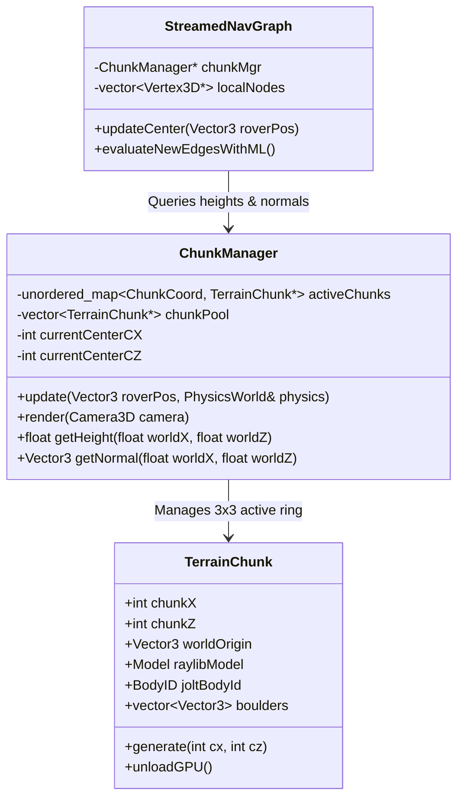

# Architectural Specification: Infinite Chunk-Based Procedural Terrain & Streamed Navigation

This document defines the technical architecture, mathematical formulations, physics collider streaming, dynamic graph adaptation, and memory management for an **infinite, on-the-fly procedurally generated planetary world** for the 3D rover simulator.

---

## 1. Executive Summary & Objectives

### Current Limitation
The existing simulator operates on a single bounded heightfield ($200\,\text{m} \times 200\,\text{m}$) draped with a fixed 26×26 NavGraph (676 nodes). Once the rover reaches the boundary, the world terminates.

### Objective
Expand the world into an **infinite, unbounded planetary expanse** that streams in newly generated terrain, physics colliders, boulders, and navigation graph nodes in real time as the rover explores, while keeping memory constant ($< 60\,\text{MB}$) and maintaining rock-solid **60 FPS** on Apple Silicon M2.

```
                            World Coordinate Space (Infinite)
      ... <--------------------------------------------------------------------> ...
                +-----------------+-----------------+-----------------+
                | Chunk (-1,  1)  | Chunk ( 0,  1)  | Chunk ( 1,  1)  |
                |   [Stream In]   |   [Stream In]   |   [Stream In]   |
                +-----------------+-----------------+-----------------+
                | Chunk (-1,  0)  |  Chunk ( 0,  0) | Chunk ( 1,  0)  |
                |     [Active]    |    [ROVER @]    |     [Active]    |
                +-----------------+-----------------+-----------------+
                | Chunk (-1, -1)  | Chunk ( 0, -1)  | Chunk ( 1, -1)  |
                |   [Stream Out]  |   [Stream Out]  |   [Stream Out]  |
                +-----------------+-----------------+-----------------+
```

---

## 2. Core Architecture & Mathematical Design

### 2.1. Coordinate Invariance & Continuous 2D Noise
Procedural chunks must match seamlessly at their edges without visible cracks or physics gaps. 
To guarantee this, elevation is sampled using **absolute world coordinates** rather than local chunk indices:

$$h(x, z) = \sum_{k=0}^{O-1} A_k \cdot \text{Simplex2D}\left(x \cdot f_k + \sigma_x, \; z \cdot f_k + \sigma_z\right) - \sum_{i} C_i(x, z)$$

Where:
* $A_k = A_0 \cdot \rho^k$ (octave persistence $\rho \approx 0.45$).
* $f_k = f_0 \cdot 2^k$ (frequency doubling / lacunarity).
* $C_i(x, z)$ represents procedural impact craters:
  $$C_i(x, z) = D_i \cdot \exp\left(-\frac{(x - x_i)^2 + (z - z_i)^2}{2 R_i^2}\right)$$
* $\sigma_x, \sigma_z$ are global planetary seed offsets.

### 2.2. Seamless Boundary Stitching Math
* Let chunk dimension be $S = 64.0\,\text{m}$ with quad resolution $N = 32$ cells.
* Each chunk grid samples $(N + 1) \times (N + 1) = 33 \times 33 = 1,089$ height points.
* World coordinate of grid vertex $(u, v)$ in Chunk $(C_x, C_z)$:
  $$X_{\text{world}} = C_x \cdot S + u \cdot \left(\frac{S}{N}\right), \quad Z_{\text{world}} = C_z \cdot S + v \cdot \left(\frac{S}{N}\right)$$
* For $u = N$ in Chunk $(C_x, C_z)$ and $u = 0$ in Chunk $(C_x + 1, C_z)$:
  $$X_{\text{world}} = C_x \cdot S + N \cdot \frac{S}{N} = (C_x + 1) \cdot S + 0 \cdot \frac{S}{N}$$
* **Mathematical identity guarantees 100% gapless mesh alignment and continuous surface normals.**

---

## 3. Subsystem Adaptations

### 3.1. Terrain Graphics (`ChunkManager` & Raylib)
* **Active Window:** A $3 \times 3$ grid (or $5 \times 5$ grid) centered on the rover's current chunk coordinate:
  $$C_x = \lfloor (P_{\text{rover}}.x + S/2) / S \rfloor, \quad C_z = \lfloor (P_{\text{rover}}.z + S/2) / S \rfloor$$
* **Object Pooling:** Pre-allocate a pool of 16 `TerrainChunk` instances in memory. When a chunk leaves the active radius, its GPU vertex buffers and textures are recycled rather than freed and reallocated, preventing GPU memory fragmentation.
* **Rendering:** Raylib renders each visible chunk model at its world translation:
  ```cpp
  for (TerrainChunk* chunk : m_activeChunks) {
      if (frustum.contains(chunk->bounds)) {
          DrawModel(chunk->model, chunk->worldPos, 1.0f, WHITE);
      }
  }
  ```

### 3.2. Jolt Physics Streaming
* Jolt allows creating and destroying static bodies on the fly via `JPH::BodyInterface`.
* Each `TerrainChunk` owns a static Jolt body:
  * **Option A: `HeightFieldShape` per Chunk:** Extremely fast, hardware-accelerated memory layout ($33 \times 33$ floats).
  * **Option B: `MeshShape`:** Built directly from the chunk's indexed triangles.
* **Staggered Body Registration:**
  * When entering a new chunk, register 1 body per physics tick ($16.6\,\text{ms}$) instead of registering all new bodies simultaneously. This guarantees zero frame drops.
* **Deterministic Obstacle Spawning:**
  * Procedural boulder positions are seeded with a deterministic spatial hash:
    $$\text{Seed}(C_x, C_z) = \text{WangHash}(C_x \cdot 73856093 \oplus C_z \cdot 19349663)$$
  * Guarantees that if the rover turns around, all boulders and rocks reappear in identical positions.

### 3.3. Egocentric Sliding-Window NavGraph
Instead of maintaining a globally infinite graph (which would consume unbounded RAM), navigation uses a **hybrid dual-layer graph**:

```
+-------------------------------------------------------------+
|               Global Waypoint Sparse Graph                  |
|    (High-level mission beacons spaced every 200m - 500m)    |
+------------------------------+------------------------------+
                               |
                               v
+-------------------------------------------------------------+
|              Local Sliding Dense NavGraph (3D)              |
|        (Egocentric 28x28 lattice anchored to Rover)         |
|   - Follows rover position as it navigates                  |
|   - Real-time raycast collision pruning with boulders       |
|   - Evaluated by TerrainTraversabilityMLP on each shift     |
+-------------------------------------------------------------+
```

1. **Local Graph Window:** A dense $28 \times 28$ lattice ($7.0\,\text{m}$ node spacing $\implies 196\,\text{m} \times 196\,\text{m}$ area) centered dynamically around the rover.
2. **Graph Shift:** When the rover crosses a node grid interval ($7\,\text{m}$):
   * Nodes falling outside the rear boundary are retired to a node pool.
   * New nodes are draped ahead over the newly streamed procedural heightfield.
   * New edges are immediately processed by `TerrainTraversabilityMLP::predict()`.
3. **Execution Latency:** Generating and evaluating 28 new edge rows takes $< 0.08\,\text{ms}$ on Apple M2 Silicon.

### 3.4. Path Planning: Infinite Exploration Horizon
* **Global Target Vector:** The user clicks a distant exploration beacon or sets a compass heading on the HUD (e.g., *Exploration Target: $1.2\,\text{km}$ North-West*).
* **Local Goal Selection:** The NavGraph projects this vector onto its outer boundary, selecting the frontier node that minimizes Euclidean distance to the global goal.
* **Dijkstra / A\* Solve:** Dijkstra computes the optimal traversability path to the current frontier node.
* **Continuous Replanning:** As the rover advances and new terrain is revealed, the horizon node advances seamlessly.

---

## 4. Class Design & Architecture



---

## 5. Memory & Performance Budget (Apple M2 Target)

| Subsystem | Active Ring ($3 \times 3 = 9$ Chunks) | Per Chunk | Total Memory | Latency per Frame |
| :--- | :--- | :--- | :--- | :--- |
| **Mesh Vertices & VBOs** | $9 \times 1,089$ vertices | $\sim 45\,\text{KB}$ | $\sim 405\,\text{KB}$ | $0\,\text{ms}$ (GPU resident) |
| **Heightfield Arrays** | $9 \times 1,089$ floats | $\sim 4.3\,\text{KB}$ | $\sim 39\,\text{KB}$ | Cache coherent |
| **Jolt Static Colliders** | 9 `HeightFieldShape` bodies | $\sim 12\,\text{KB}$ | $\sim 108\,\text{KB}$ | $< 0.1\,\text{ms}$ broadphase |
| **Sliding NavGraph** | 784 nodes, 2,800 edges | — | $\sim 2.5\,\text{MB}$ | $< 0.15\,\text{ms}$ solve |
| **ML Edge Evaluation** | Incremental (~120 edges/shift) | — | $< 50\,\text{KB}$ | $< 0.02\,\text{ms}$ |
| **Total Overhead** | — | — | **$< 15\,\text{MB}$** | **$< 0.4\,\text{ms}$ total** |

---

## 6. Phased Implementation Roadmap

* **Milestone 7.1: Continuous Terrain Sampler**
  * Refactor noise functions in `TerrainHeightfield` from indexed array logic to pure world-space sampling: `getHeightAt(worldX, worldZ)`.
* **Milestone 7.2: `TerrainChunk` & `ChunkManager`**
  * Implement $64\,\text{m} \times 64\,\text{m}$ chunk containers with shared edge vertices and a $3 \times 3$ active ring around the rover.
* **Milestone 7.3: Dynamic Jolt Physics Streaming**
  * Attach static `HeightFieldShape` colliders to each active chunk; register/unregister with Jolt body interface during chunk transitions.
* **Milestone 7.4: Deterministic Procedural Boulders**
  * Seed crater impacts and boulder fields using spatial coordinate hashes.
* **Milestone 7.5: Sliding-Window NavGraph & Frontier Routing**
  * Anchor the NavGraph to the rover and implement frontier exploration waypoints evaluated by `TerrainTraversabilityMLP`.
* **Milestone 7.6: HUD Long-Range Radar & Compass**
  * Add an exploration mini-map / radar display to `RoverTelemetryHUD` showing discovered terrain chunks and global compass heading.
