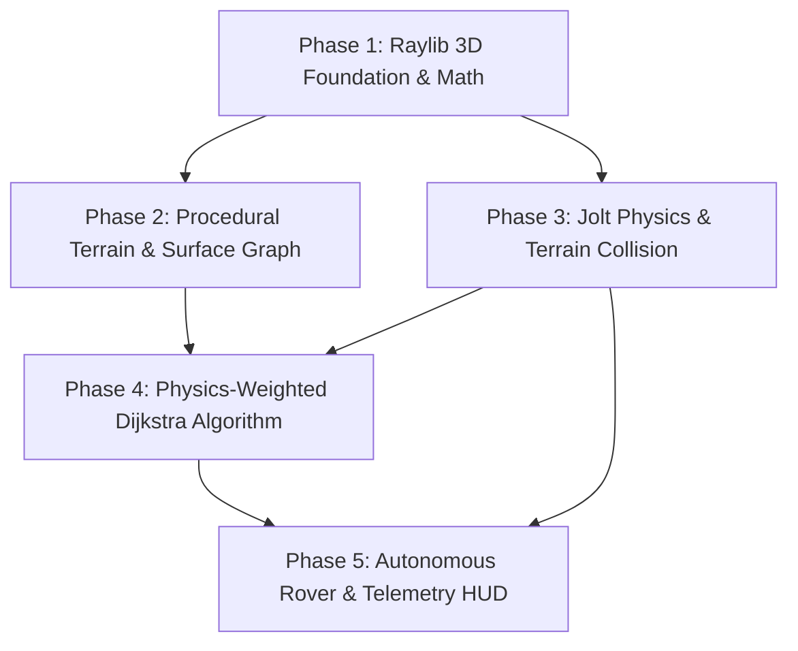

# Phased Implementation Roadmap: 3D Planetary Rover Simulator

This directory contains the detailed engineering specifications, class designs, mathematical formulations, and acceptance criteria for each phase of developing the **3D Planetary Rover on Terrain** simulation with **Raylib** and **Jolt Physics**.

---

## Phases Overview & Dependency Graph

---

## Phase Documents

| Phase | Document | Focus & Core Deliverables | Status |
| :--- | :--- | :--- | :---: |
| **Phase 1** | [phase-1-raylib-foundation.md](file:///Users/louie/Documents/GitHub/dijkstra_sfml/docs/phases/phase-1-raylib-foundation.md) | Raylib 3D viewport, `Camera3D` orbital controls, 3D math (`raymath.h`), refactoring `Vertex3D`, and 3D node/edge rendering. | Completed |
| **Phase 2** | [phase-2-terrain-generation.md](file:///Users/louie/Documents/GitHub/dijkstra_sfml/docs/phases/phase-2-terrain-generation.md) | Procedural Martian heightfield, surface normals & slope angles, draped 3D graph (`RoverNavGraph`), and 3D raycast mouse picking. | Completed |
| **Phase 3** | [phase-3-physics-engine-integration.md](file:///Users/louie/Documents/GitHub/dijkstra_sfml/docs/phases/phase-3-physics-engine-integration.md) | Jolt Physics integration, `PhysicsWorld`, `HeightFieldShape`, static boulders, and dynamic edge-blocking raycasts. | Completed |
| **Phase 4** | [phase-4-dijkstra-physics-cost.md](file:///Users/louie/Documents/GitHub/dijkstra_sfml/docs/phases/phase-4-dijkstra-physics-cost.md) | Physical work & traction cost functions, friction slip thresholds ($\tan\theta > \mu$), and 3D step-by-step snapshot replay. | Completed |
| **Phase 5** | [phase-5-rover-simulation-and-telemetry.md](file:///Users/louie/Documents/GitHub/dijkstra_sfml/docs/phases/phase-5-rover-simulation-and-telemetry.md) | 4-wheel rover rigid body & suspension, Pure Pursuit waypoint navigation, `rlImGui` telemetry HUD, and preset scenarios. | Completed |

---

## Architectural Principles Across All Phases

1. **Separation of Concerns**: Keep simulation physics, graph topological search, and graphical rendering strictly decoupled.
2. **Deterministic Simulation**: Physics updates run at a fixed tick rate ($60\text{ Hz}$) decoupled from rendering framerate.
3. **Preserve Algorithmic Introspection**: Retain the step-by-step Dijkstra snapshot history (`stepForward`, `stepBackward`, timeline scrubbing) from the original project.
4. **Cross-Platform Portability**: Maintain compatibility with native macOS (Apple Silicon / Intel) and WebAssembly (Emscripten WebGL 2.0).
