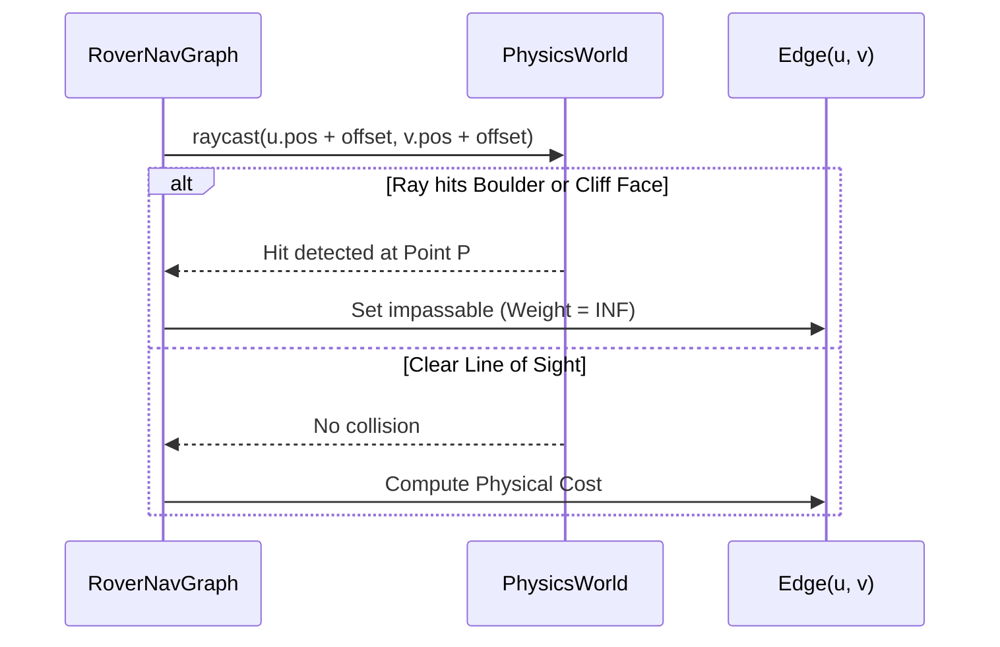

# Phase 3: Physics Engine Integration (Jolt Physics)

## 1. Goal & Objectives
Integrate the **Jolt Physics** engine into the project, construct a physical terrain collision shape (`HeightFieldShape`), implement static obstacle collisions (boulders/rocks), and establish physical line-of-sight raycasts to dynamically invalidate blocked graph edges.

---

## 2. Jolt Physics Setup & Architecture

### 2.1. Library Integration
* Jolt is integrated via CMake FetchContent or compiled as a static library (`libJolt.a`).
* Core requirements:
  * Multithreading via Jolt's `JobSystemThreadPool`.
  * Physics world allocations via `TempAllocatorImpl`.
  * Collision filtering via `BroadPhaseLayerInterface` and `ObjectLayerPairFilter`.

### 2.2. Physics Wrapper: `PhysicsWorld`

```cpp
#pragma once
#include <Jolt/Jolt.h>
#include <Jolt/Physics/PhysicsSystem.h>
#include <Jolt/Physics/Body/BodyInterface.h>
#include <raylib.h>

class PhysicsWorld {
public:
    void init();
    void step(float deltaTime);
    void shutdown();

    // Terrain & Obstacles
    void createTerrainHeightfield(const float* heightData, int cols, int rows, float spacing);
    void spawnBoulder(Vector3 pos, float radius);

    // Queries
    bool raycast(Vector3 from, Vector3 to, Vector3* hitPoint = nullptr, Vector3* hitNormal = nullptr);
    bool checkSphereClearance(Vector3 center, float radius);

    JPH::PhysicsSystem& getSystem() { return m_physicsSystem; }

private:
    JPH::PhysicsSystem m_physicsSystem;
    std::unique_ptr<JPH::TempAllocator> m_tempAllocator;
    std::unique_ptr<JPH::JobSystemThreadPool> m_jobSystem;
    JPH::BodyID m_terrainBodyId;
};
```

---

## 3. Physical Collision Meshes

### 3.1. Terrain Heightfield Shape
* Convert height data into Jolt's native `JPH::HeightFieldShapeSettings`.
* Scale to match Raylib's terrain mesh:
  * Elevation range: $0\text{ m} \to 30\text{ m}$.
  * Material: High restitution damping, default static friction $\mu_s = 0.70$.

### 3.2. Static Boulders & Hazard Obstacles
* Physical rigid bodies with `EMotionType::Static`.
* Collision shape: `JPH::SphereShape` or convex hull mesh.
* Scattered procedurally across the terrain surface.

---

## 4. Line-of-Sight Edge Validation (Raycasting)

Before running Dijkstra, or when obstacles shift, `RoverNavGraph` verifies each edge $(u, v)$ against physical collision geometry:



* Ray origin and target are elevated by the vehicle radius ($0.6\text{ m}$) above ground level to ensure chassis clearance.
* If a boulder obstructs the ray, the edge weight is set to $\infty$ (rendered in dashed dark red).

---

## 5. Verification Test: The Rolling Test Sphere

To verify the Jolt integration before adding the complex rover:
1. Spawn a dynamic rigid body sphere (radius $1.0\text{ m}$, mass $50\text{ kg}$) above an incline.
2. Step physics at fixed $60\text{ Hz}$.
3. Synchronize sphere's Raylib rendering position with Jolt's body transform:
   ```cpp
   JPH::RVec3 p = bodyInterface.GetCenterOfMassPosition(sphereId);
   DrawSphere((Vector3){ (float)p.GetX(), (float)p.GetY(), (float)p.GetZ() }, 1.0f, BLUE);
   ```
4. Confirm sphere accelerates down the slope, rolls realistically, and deflects off boulders.

---

## 6. Acceptance Criteria & Verification

- [x] Jolt Physics initializes, updates, and shuts down without memory leaks.
- [x] Physics terrain collision surface aligns precisely with the visual Raylib terrain mesh.
- [x] Test spheres bounce and roll along the slope contours under simulated gravity ($g = -9.81\text{ m/s}^2$ or Martian $g = -3.71\text{ m/s}^2$).
- [x] Dynamic raycasting successfully cuts graph edges intersecting with boulders.
