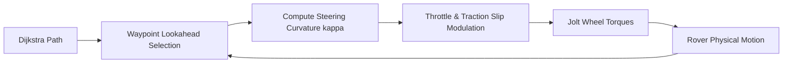

# Phase 5: Autonomous Planetary Rover Simulation & Telemetry HUD

## 1. Goal & Objectives
Construct a physical 4-wheeled planetary rover with chassis rigid body and spring-damper suspension, implement the autonomous **Pure Pursuit** waypoint-following controller, and create a real-time **rlImGui** telemetry dashboard.

---

## 2. Rover Vehicle Rig Architecture

```
                 +-----------------------------+
                 |        Chassis Body         |
                 |      (Mass: 800 kg)         |
                 +----+---------+---------+----+
                      |         |         |
                      | (Suspension Springs)
                      v         v         v
                  [Wheel FL] [Wheel FR] [Wheel RL] ...
```

### 2.1. Physical Components
* **Chassis Body:**
  * Box dimensions: $2.4\text{ m} \times 1.2\text{ m} \times 0.8\text{ m}$.
  * Mass: $800\text{ kg}$, with center of mass lowered by $0.25\text{ m}$ to reduce rollover risk.
* **Wheels (4 or 6 units):**
  * Cylindrical rigid bodies (radius $0.45\text{ m}$, width $0.3\text{ m}$).
  * Connected via Jolt's `VehicleConstraint` or 6-DOF spring-damper constraints.
* **Suspension Characteristics:**
  * Rest length: $0.4\text{ m}$.
  * Spring stiffness: $k = 35,000\text{ N/m}$.
  * Damping coefficient: $c = 3,500\text{ N}\cdot\text{s/m}$.

---

## 3. Autonomous Path-Following: Pure Pursuit Controller

Once Dijkstra produces the path $\mathcal{P} = \{\mathbf{w}_0, \mathbf{w}_1, \dots, \mathbf{w}_N\}$, the rover drives itself from start to finish:



### 3.1. Mathematical Formulation
1. **Lookahead Point:** Find the forward waypoint $\mathbf{w}_k$ at lookahead distance $L_d$ (typically $4.0\text{ m}$).
2. **Steering Curvature:**
   $$\kappa = \frac{2 \sin(\alpha)}{L_d}$$
   Where $\alpha$ is the angle between the rover's forward heading vector and the vector to $\mathbf{w}_k$.
3. **Throttle Modulation & Anti-Slip:**
   * **Incline Assist:** If driving uphill ($\Delta y > 0$), increase motor torque by factor $(1 + 1.5 \sin\theta)$.
   * **Traction Control (TCS):** If wheel angular slip ratio $S = \frac{\omega R - v}{v} > 0.20$, throttle is momentarily cut to regain static grip.

---

## 4. Telemetry Dashboard (rlImGui)

A docking telemetry HUD rendered in real-time over the Raylib 3D viewport:

### Telemetry Gauges:
* **Speedometer & Odometer:** Current speed ($\text{m/s}$, $\text{km/h}$), total distance traveled.
* **Attitude Indicator (Artificial Horizon):**
  * Pitch and Roll angles.
  * Visual "Critical Rollover" zone ($> 28^\circ$).
* **Battery Consumption:** Cumulative work $\int (\mathbf{F}_{\text{motor}} \cdot \mathbf{v}) \, dt$ displayed in kilojoules ($\text{kJ}$).
* **Wheel Slip Monitor:** 4-wheel bar gauges indicating traction loss per tire.

### Interactive Simulation Controls:
* **Deploy Rover:** Spawns/resets the physical rover at the Start node.
* **Physics Sliders:** Adjust Martian gravity ($3.71\text{ m/s}^2$) vs Earth gravity ($9.81\text{ m/s}^2$), tire friction, and motor torque.
* **Camera View Toggles:**
  1. *Orbit View:* Free orbital rotation.
  2. *Chase Cam:* Follows behind rover at fixed distance.
  3. *Mast Cam:* First-person camera mounted on rover sensor mast.

---

## 5. Preset Showcase Scenarios

| Preset | Scene Description | Expected Behavior |
| :--- | :--- | :--- |
| **The Olympus Crater** | Deep impact crater separating Start and Goal. | Rover drives along the gentle rim pass; attempts to drive into the crater stall or trigger rollover warnings. |
| **Loose Scree Slope** | Low-friction hillside with moving boulders. | Rover navigates hard bedrock patches; traction control pulses wheels to climb without spinning out. |
| **Boulder Slalom** | Narrow maze between impassable rock hazards. | Pure Pursuit smoothly weaves through waypoints without clipping wheel hubs against rocks. |

---

## 6. Acceptance Criteria & Verification

- [ ] Rover vehicle drops onto terrain, suspension compresses, and chassis stabilizes.
- [ ] Rover autonomously drives from Start to Goal along the Dijkstra path without human intervention.
- [ ] Traction control successfully suppresses wheel spin on steep inclines.
- [ ] Telemetry HUD accurately updates speed, pitch/roll, and battery energy in real time.
- [ ] User can switch between Orbit, Chase, and Mast camera modes during driving.
