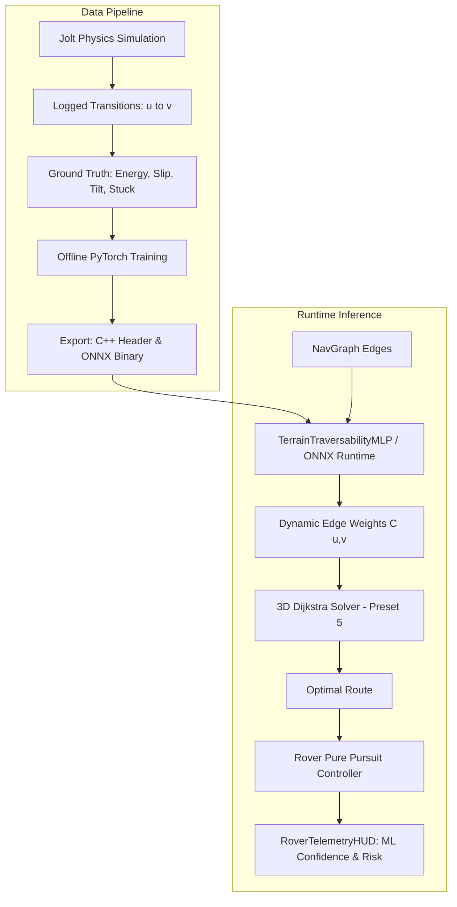

# Phase 6: Machine Learning Terrain Traversability & Navigation

## 1. Goal & Objectives
Integrate a learned **Machine Learning (ML) Traversability Model** into the 3D physics simulator. The model replaces or augments hand-tuned heuristic cost functions with a data-driven predictor that estimates true physical energy consumption, wheel-soil slip ratio, and rollover risk across arbitrary Martian terrain.

---

## 2. System Architecture & Information Flow

---

## 3. Mathematical & Model Formulation

### 3.1. Edge Input Features ($\mathbf{x} \in \mathbb{R}^8$)
For each directed candidate edge $(u \to v)$ in the 3D NavGraph:
1. **$\Delta y$:** Elevation difference ($v.y - u.y$).
2. **$\theta_{\text{segment}}$:** Longitudinal slope angle ($\arctan(\Delta y / d_{\text{horizontal}})$).
3. **$\theta_{\max}$:** Maximum local surface incline ($\max(\theta_u, \theta_v)$).
4. **$\mu_s$:** Surface friction coefficient ($0.5 \cdot (\mu_u + \mu_v)$).
5. **$\Delta \psi$:** Steering deflection angle from incoming trajectory vector.
6. **$h_{\text{roughness}}$:** Standard deviation of heightfield elevation along segment raycast.
7. **$g$:** Gravitational acceleration ($\text{Mars}: -3.71, \text{Moon}: -1.62, \text{Earth}: -9.81$).
8. **$d_{\text{euc}}$:** 3D Euclidean distance ($\|\mathbf{p}_v - \mathbf{p}_u\|_2$).

### 3.2. Network Architecture (Physics-Informed MLP)
* **Input Layer:** 8 scalar features (normalized with z-score running statistics).
* **Hidden Layer 1:** 32 units, ReLU activation.
* **Hidden Layer 2:** 16 units, ReLU activation.
* **Output Layer:** Single scalar traversability cost multiplier $\hat{k} \ge 0$ (via Softplus) and passability probability $\hat{P}(\text{traversable}) \in [0, 1]$ (via Sigmoid).

$$\text{Final Edge Cost } C(u, v) = \begin{cases} \infty & \text{if } \hat{P}(\text{traversable}) < P_{\text{safe}} \\ d_{\text{euc}} \cdot (1.0 + \hat{k}) & \text{otherwise} \end{cases}$$

---

## 4. Key Performance Indicators & Acceptance Criteria

* [ ] **Inference Latency:** Evaluating all $\sim 2,500$ edges in the 26×26 graph takes $< 0.5\,\text{ms}$ on Apple M2 Silicon.
* [ ] **Simulation Frame Rate:** Maintain rock-solid 60 FPS during real-time edge evaluation and path recomputation.
* [ ] **Safety & Slip Reduction:** ML-guided path exhibits $> 25\%$ lower wheel slip and zero rollover events compared to the unweighted Euclidean baseline (Preset 2).
* [ ] **HUD Telemetry:** Real-time visual display in `RoverTelemetryHUD` showing:
  * Active Model (MLP vs Classical Presets)
  * ML Inference Latency ($\mu\text{s}$)
  * Predicted vs Actual Energy Consumption ($\text{kJ}$)
  * Route Danger / Slip Warning Heatmap
* [ ] **Compatibility:** Fully operational under native macOS desktop (`make run-rover`) with zero dynamic heap allocations in the inner loop.

---

## 5. Areas for Further Study

To deepen theoretical and practical mastery of this technology stack, review:
1. **Terramechanics:** Wong's *Theory of Ground Vehicles* (Bekker pressure-sinkage & Mohr-Coulomb soil shear).
2. **Learned Search:** *Neural A\* Search* (Yonetani et al., ICLR 2021) and D\* Lite for dynamic replanning.
3. **High-Performance C++ Inference:** ONNX Runtime CoreML Execution Provider, SIMD vectorization with ARM NEON, and INT8 model quantization.
4. **Deep Reinforcement Learning:** Continuous action space control with PPO and domain randomization in physics simulators.
