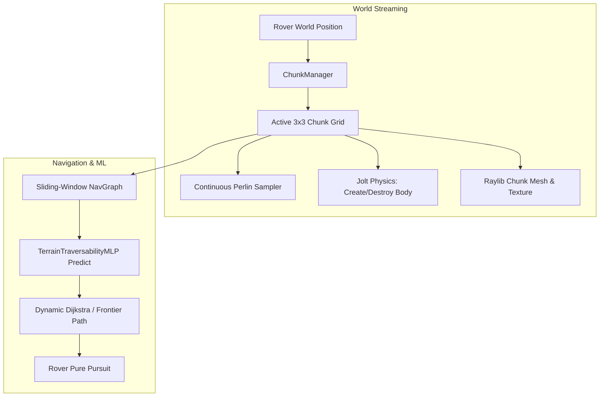

# Phase 7: Infinite Chunk-Based Procedural Terrain & Streamed Navigation

## 1. Goal & Objectives
Transform the simulator from a single bounded $200\,\text{m} \times 200\,\text{m}$ map into an **infinite, dynamically streamed planetary world**. As the rover drives in any direction, new terrain chunks, Jolt physics colliders, procedural boulders, and NavGraph nodes are generated on the fly and rendered seamlessly at 60 FPS.

---

## 2. System Architecture & Information Flow

---

## 3. Engineering Specifications

### 3.1. Chunk Geometry & Stitching
* **Chunk Dimensions:** $64.0\,\text{m} \times 64.0\,\text{m}$ per chunk.
* **Vertex Resolution:** $33 \times 33$ vertices ($32 \times 32$ quads = 2,048 triangles per chunk).
* **Seamless Boundary Stitching:** Boundary vertices sample identical world-space coordinates, eliminating visual mesh cracks and physics gaps.
* **Active Radius:** $3 \times 3$ chunks ($192\,\text{m} \times 192\,\text{m}$ active area) centered around the rover's current chunk coordinate $(C_x, C_z)$.

### 3.2. Physics Colliders
* Each active chunk registers its own static `HeightFieldShape` (or `MeshShape`) in Jolt Physics.
* Chunks leaving the active ring are detached and returned to an object pool.

### 3.3. Dynamic Sliding NavGraph & ML
* The dense NavGraph lattice shifts with the rover's local exploration envelope.
* Newly draped edges are automatically evaluated by `TerrainTraversabilityMLP::predict()`.
* Dijkstra plans local trajectories toward long-range exploration beacons.

---

## 4. Key Performance Indicators & Acceptance Criteria

* [ ] **Unbounded Exploration:** Rover can drive infinitely in any cardinal or diagonal direction without hitting map borders or falling into voids.
* [ ] **Zero Visual Seams:** Neighboring chunk meshes align with sub-millimeter precision and smooth lighting normal transitions.
* [ ] **Smooth 60 FPS Streaming:** Chunk generation and physics body creation execute in $< 0.5\,\text{ms}$, producing zero frame stutters during boundary transitions.
* [ ] **Constant Memory Usage:** Active chunks, meshes, and physics bodies are recycled using an object pool, keeping memory consumption bounded under $60\,\text{MB}$.
* [ ] **Deterministic Re-visitation:** Returning to an earlier coordinate reproduces the identical hills, craters, and boulders via spatial coordinate hashing.

*(For detailed mathematical formulas and memory budgets, see [docs/infinite-procedural-terrain-architecture.md](file:///Users/louie/Documents/GitHub/dijkstra_sfml/docs/infinite-procedural-terrain-architecture.md))*
